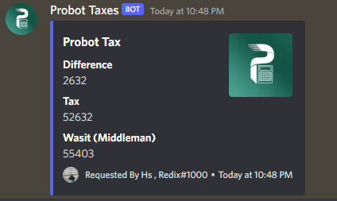

## What is probot-taxes ?
Package that can calculate Probot taxes perfectly .\
Command Example:

## Installation
```
npm install probot-taxes
```

## Usage
Discord.js v13 Example :
```js
let Taxes = require('probot-taxes')

client.on('messageCreate', message => {
    if (!message.guild) return;
    if (message.author.bot) return;
    if (message.content.toLowerCase().startsWith('tax')) {
    let amount = message.content.split(' ')[1]
    if (!amount) return message.reply({content: `You should specify a vaild amount .`})
    let Tax;
    try {
    Tax = Taxes(amount)
    } catch (err) {
    return message.reply({content: `You should specify a vaild amount .`})
    }
    let embed = new Discord.MessageEmbed()
    .setTitle('Probot Tax')
    .addField(`Difference`, `${Tax.difference}`)
    .addField(`Tax`, `${Tax.tax}`)
    .setColor('BLURPLE')
    .setThumbnail(client.user.avatarURL())
    .setFooter({text: `Requested By ${message.author.tag}`, iconURL: message.author.avatarURL({dynamic:true})})
    .setTimestamp()
    .addField(`Wasit (Middleman)`, `${Tax.wasit}`)
    message.reply({embeds: [embed]})
    }
})
```
## Opject
```js
let Taxes = require('probot-taxes')
console.log(Taxes('50k'))
//=> { difference: 2632, tax: 52632, wasit: 55403}
```
## Links
[Support Server](https://discord.gg/holy-s)
